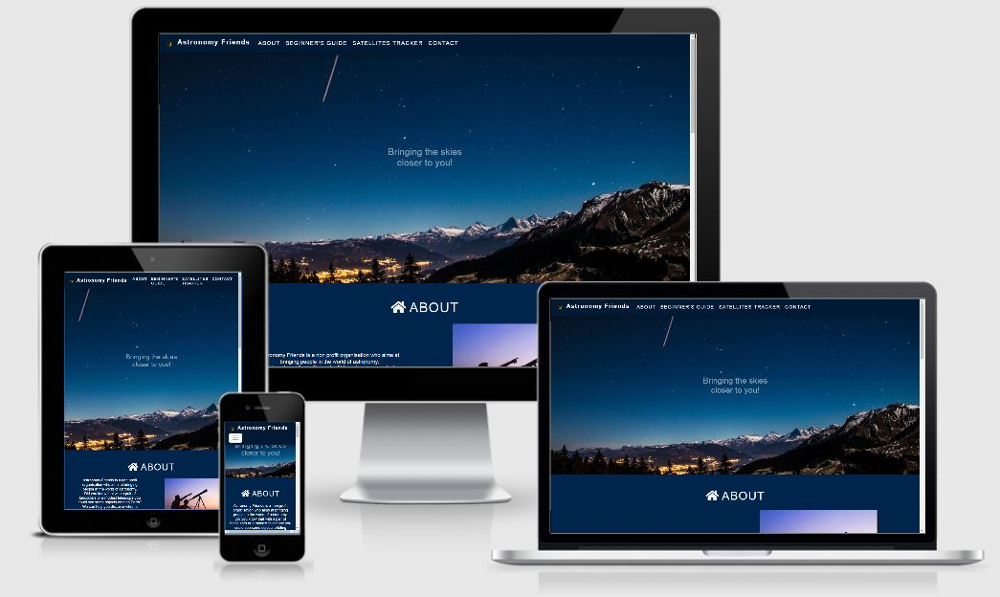
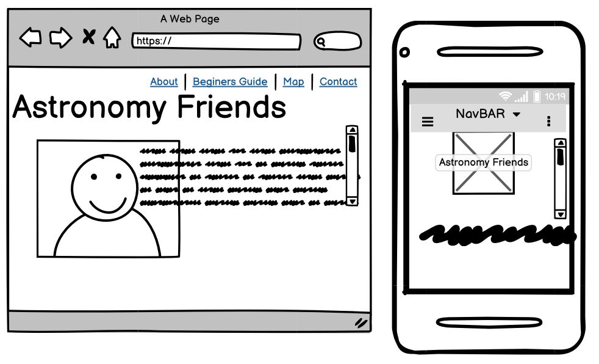
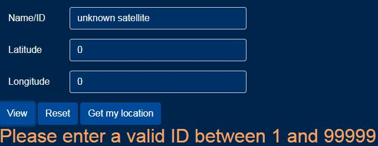

<h1 align="center">Astronomy Friends</h1>

The live website of **Astronomy Friends** can be viewed <a href="https://emusat2021.github.io/Astronomy-Friends" target="_blank">here</a>



2nd Milestone project: Interactive Front-end Development - <a href="https://codeinstitute.net/" target="_blank">Code Institute</a> assignment project.

**Astronomy Friends** is an non profit organisation who aims at bringing people in the world of astronomy.

**Astronomy Friends** purpose is to incurage peple to to dive in in the wonderful world of astronomy?

The webpage can be used to help people discover when a specific object will pass the skies.<br>
                        
 
The webpage has a Beginner's Guide as well as Satellites Tracker section which can be used to know in advance when a specific object will pass above a location.

This webpage gives the opportunity to contact **Astronomy Friends** by providing a form to send feedback or posible suggestions/ideas.


## Table of Contents


## User Experience (UX)

- ### User stories

  - #### First Time Visitor Goals

    As a... | I want to... | To be able to...
    ---------|--------------|--------------
    First Time Visitor | easily obtain basic information about astronomy | learn more about this field
    First Time Visitor | get recommendations about what tools I can use | make a good choice when buying a telescope
    First Time Visitor | easily find the links to their social media accounts | be able to read more about Astronomy Friends
    First Time Visitor | easily navigate the website | quickly find what I'm looking for
    <br>

  - #### Returning Visitor Goals
    <br>

    As a... | I want to... | To be able to...
    ---------|--------------|--------------
    Returning Visitor | obtain information about a specific celestial object in orbit | know if/when the object is visible
    Returning Visitor | choose a location on a map | know when I will be able to see the object in my location
    Returning Visitor | find the best way to get in contact with the organisation | get answers to any questions I may have
    Returning Visitor | see how much time is left until a specific object passes above my location | prepare myself for my observation
    <br>
  -  #### Frequent User Goals

        As a... | I want to... | To be able to...
        ---------|--------------|--------------
        Frequent User | give a specific object id myself | know if/when the object is visible
        Frequent User | easily find an object ID giving the name | know if/when the object is visible
        Frequent User | send further advice  | be able to contact Astronomy Friends 
        Frequent User |  access the website from any device | use the website anytime and anywhere

-   ### Design
    -   #### Colour Scheme
        -   The two main colours used are blue and white.
    -   #### Typography
        -   The Open Sans font is the main font used throughout the whole website with Sans Serif as the fallback font in case for any reason the font isn't being imported into the site correctly.
    -   #### Imagery
        -   Imagery is important. The large, background hero image is designed to be striking and catch the user's attention.

*   ### Wireframes




## Features

#### Navbar
- Navbar at the top - helping user to easily navigate to diferent sections.
#### Back to the top
- Back to the top button/arrow visible on the right bottom-side of the page.
#### Collapsed divs
- In the *Beginner's guide* section there are three collapsed divs with a *Read more* button. When the user presses the *Read more* button, the div expands, presenting some information about the specific subject. Also, with the help of Javascript, the text on the button changes to *Read less*. When the user presses the *Read Less* button, the divs collapses back and hides the information.
#### Images
Images about Astronomy which bring more ease to understand the presented subject.
#### APIs
There are multiple APIs used in this website:
- <a href="https://satellites.fly.dev/" target="_blank">Satellite Passes API</a> (used to predict when a satellite will pass above a specific location)
- <a href="https://www.emailjs.com/" target="_blank">EmailJS</a> (used to send feedback via email)
- <a href="https://developers.google.com/maps/documentation" target="_blank">Google Maps</a> (used to choose a specific location on the map)
#### Google Maps
The website uses Google Maps to facilitate the user in choosing a location in order to observe an object.
#### Forms
- The first form used in the page is located in the *Satellites Tracker* section. The form is used to gather necessary data in order to identify and locate an object in orbit. It has three input boxes: Name/ID, Latitude, Longitude as well as three buttons: View, Reset, Get my location. View is used to submit the form, Reset is used to reset the form while Get my location is used to draw a Marker on the map at the location of the user.
- The second form is located in the *Contact* section and it is used to get feddback from the user. There is an EmailJS API attached to the form which makes possible to send a user's message to the owner of the site.
#### Favorite Objects
In the *Satellites Tracker* section there is a list with three favorite objects: the International Space Station (ISS), Hubble Space Telescope (HST), Tianhe. When the user clicks on a favorite object, the name of the respective object is automatically copied in the Name-ID input textbox.
#### Database with objects
Using a file located <a href="https://tle.info/data/ALL_TLE.ZIP">here</a> it was possible to extract a list with tens of thousands of object names with their corresponding Norad ID. The list is in the ```data.js``` file.
#### Autocomplete list
In order to ease the search for a specific object an autocomplete list was implemented using code located <a href="https://www.w3schools.com/howto/howto_js_autocomplete.asp">here</a>. When the user starts typing in the Name/ID input box, the autocomplete script suggests a list of maximum 30 names from the database.
#### Favicon 
- A favorite icon has been implemented so that a user can recognize the logo on the browser tab.
#### Footer
The footer is styled using Bootstrap. It contains links to social media as well as a disclaimer and a copyright note.
#### Single page HTML
the site is constructed using a single page HTML with sections. The following sections are available:
- About
- Beginner's guide
- Satellites Tracker
- Contact

### Features Left to Implement
* Add more information about Astronomy, tools used
* Use cookies to improve user experience (chosen objects can be saved in cookies and shown as history)
## Technologies Used

### Languages Used

- [HTML5](https://en.wikipedia.org/wiki/HTML5)
- [CSS3](https://en.wikipedia.org/wiki/Cascading_Style_Sheets)
- [Javascript](https://en.wikipedia.org/wiki/Javascript)

### Frameworks, Libraries & Programs Used

1. [Bootstrap 4.4.1:](https://getbootstrap.com/docs/4.4/getting-started/introduction/)
    - Bootstrap was used to assist with the responsiveness and styling of the website.
1. [Hover.css:](https://ianlunn.github.io/Hover/)
    - Hover.css was used on the Social Media icons in the footer to add the float transition while being hovered over.
1. [Google Fonts:](https://fonts.google.com/)
    - Google fonts were used to import the 'Titillium Web' font into the style.css file which is used on all pages throughout the project.
1. [Font Awesome:](https://fontawesome.com/)
    - Font Awesome was used on all pages throughout the website to add icons for aesthetic and UX purposes.
1. [jQuery:](https://jquery.com/)
    - jQuery came with Bootstrap to make the navbar responsive but was also used for the smooth scroll function in JavaScript.
1. [Git](https://git-scm.com/)
    - Git was used for version control by utilizing the Gitpod terminal to commit to Git and Push to GitHub.
1. [GitHub:](https://github.com/)
    - GitHub is used to store the projects code after being pushed from Git.
1. [IrfanView:](https://www.irfanview.com/)
    - IrfanView was used to resize images, logo and edit photos for the website.
1. [Balsamiq:](https://balsamiq.com/)
    - Balsamiq was used to create the [wireframes](https://github.com/) during the design process.

## Testing

The W3C Markup Validator and W3C CSS Validator Services were used to validate every page of the project to ensure there were no syntax errors in the project.

-   [W3C Markup Validator](https://validator.w3.org/#validate_by_input)
    
    There were two errors in the ```index.html``` file which were corrected. The errors were corrected by adding the missing closing tag.
    

    There were four warnings in the ```index.html``` file which were corrected. The warnings were corrected by removing the type attribute and by adding heading  tags to sections where missing.
    
-   [W3C CSS Validator](https://jigsaw.w3.org/css-validator/#validate_by_input)

    No errors were detected.
-   [Static Code Analysis Tool for JavaScript](https://jshint.com/)

    No errors were detected.

### Testing User Stories from User Experience (UX) Section

-   #### First Time Visitor Goals


    1. As a First Time Visitor, I want to easily obtain basic information about astronomy to be able to learn more about this field.
        1. The *Beginner's guide* section can easily be accessed, either by clicking on the Navbar menu or by scrolling. The section's title is highly visible by using a heading and an icon.
        2. The *Beginner's guide* section contains images which visually indicate the specific area contained in the respective card.
        3. In the *Beginner's guide* section, in the *About Astronomy* card, when an user clicks on the *Read more* button, a div is revealed, containing information about the specific topic. The *Read more* text on the button becomes *Read less*, showing that the Javascript code works. When an user clicks on the *Read less* button, the div is concealed. The *Read less* text on the button becomes *Read more*, showing that the Javascript code works.

    2. As a First Time Visitor, I want to get recommendations about what tools I can use to be able to make a good choice when buying a telescope.
        1. In the *Beginner's guide* section, in the *Binoculars and Telescopes* card, when an user clicks on the *Read more* button, a div is revealed, containing information about the specific topic. The *Read more* text on the button becomes *Read less*, showing that the Javascript code works. When an user clicks on the *Read less* button, the div is concealed. The *Read less* text on the button becomes *Read more*, showing that the Javascript code works.

    3. As a First Time Visitor, I want to easily find the links to their social media accounts to be able to be able to read more about Astronomy Friends.
        1. The links to the social media accounts are located on the footer of the page. By using light icons on dark blue background, the icons can easily be spotted. There are links to Facebook, Twitter, Instagram and Youtube.
    4. As a First Time Visitor, I want to easily navigate the website to be able to quickly find what I'm looking for.
        1. In order to accomplish that, the website was designed as a single page HTML. All the sections can easily be accessed through the Navbar menu located on the top of the page.


-   #### Returning Visitor Goals

    1. As a Returning Visitor, I want to obtain information about a specific celestial object in orbit to be able to know if/when the object is visible.
        
        1. For this requirement, the user can use the form in *Satellites tracker* section. There are explanation in the sub-section *How it works*. More explanations about the terms like *Altitude*, *Azimuth* and *Azimuth octant* are found in the *Beginner's guide* section, under the *About Astronomy* card.
        1. Test input validators: Name/ID input textbox is empty. The *required* attribute correctly gives feedback to the user that a value is required in that field.
        
        1. Test input validators: Name/ID number < 1. A message is displayed in a div bellow the form which tells the user that the respective field must be filled out.
        
        1. Test input validators: Name/ID number > 99999. A colored message is displayed in a div below the form which tells the user that a valid ID between 1 and 99999 must be entered.
        
        1. Test input validators: Name/ID contains a string which does not have ID in parenthesis. A colored message is displayed in a div below the form which tells the user that a valid ID between 1 and 99999 must be entered.
        
        1. Test input validators: latitude empty. A message is displayed under the respective input textbox which tells the user that the respective field must be filled out.
        
        1. Test input validators: latitude < -90. A colored message is displayed in a div below the form which tells the user that a valid latitude between -90 and 90 must be entered.
        
        1. Test input validators: latitude > 90. A colored message is displayed in a div below the form which tells the user that a valid latitude between -90 and 90 must be entered.
        
        1. Test input validators: longitude empty. A message is displayed under the respective input textbox which tells the user that the respective field must be filled out.
        
        1. Test input validators: longitude < -180. A colored message is displayed in a div below the form which tells the user that a valid longitude between -180 and 180 must be entered.
        
        1. Test input validators: longitude > 180. A colored message is displayed in a div below the form which tells the user that a valid longitude between -180 and 180 must be entered.
        
        1. Test of autocomplete function: objects are found from the database and the limit is 30 objects; when the user clicks on a suggestion, the string is copied in the input box.
        
        1. Test of Favorite objects list, the Name with ID is copied to the input box.
        1. Test of Reset button: when the user clicks on *Reset* button, the form is reset to the initial values, the timer is stopped and the info divs are cleared.
        1. Test of Satellite Passes API request: an ID which does not exist yet (99999). There is a 400 error from API and a colored message is displayed in a div below the form which tells the user that there was an invalid request.
        
        1. Test of Satellite Passes API request: request is successful but the object does not pass above specified coordinates.
        
        1. Test of Satellite Passes API request: request is successful and the object passes above the skies.
        


    2. As a Returning Visitor, I want to choose a location on a map to be able to know when I will be able to see the object in my location.

        1. Test with location services not enabled: a colored message is displayed in a div below the form which tells the user that location access must be allowed.
        
        1. Test the click "Get my location" button: a Marker is put on the current location of the user and the coordinates are updated in the input textboxes.
        
        1. Test the click "Get my location" button: when there is a Marker present on the map, the position of the Marker is updated, i.e. a new Marker is not created.

    3. As a Returning Visitor, I want to find the best way to get in contact with the organisation to be able to get answers to any questions I may have.
        1. Test to send the Contact form without Name: a message is displayed under the respective input textbox which tells the user that the respective field must be filled out.
        
        1. Test to send the Contact form without email address: a message is displayed under the respective input textbox which tells the user that the respective field must be filled out.
        
        1. Test to send the Contact form with an invalid email address: a message is displayed under the respective input textbox which tells the user that the respective field must be filled out.
        
        1. Test to send the Contact form without without suggestions: a message is displayed under the respective input textbox which tells the user that the respective field must be filled out.
        

    4. As a Returning Visitor, I want to see how much time is left until a specific object passes above my location to be able to prepare myself for my observation.
        1. Test of the countdown timer when the current time is before the rise time of the object: the count down is shown counting down and the time difference is correct.
        1. Test of the countdown timer when the current time is after the rise time but before the set time of the object: the webpage displays "<object> is above the horizon now!".
        1. Test of the countdown timer when the current time is after the set time of the object: the webpage displays "Press View for the next pass of <object>"

-   #### Frequent User Goals

    1. As a Returning Visitor, I want to give a specific object id myself to be able to know if/when the object is visible.
        1. The user gives a valid object id, like 25544 and doesn't click on the object in the suggestions list. It clicks on View and the Satellite Passes API returns a valid response.
    2. As a Returning Visitor, I want to easily find an object ID by giving the name to be able to know if/when the object is visible.
        1. The user starts typing an object name in the Name/ID input textbox and the suggestion list appears. The user chooses the desired object name from the list which is then copied to the Name/ID field. It clicks on View and the Satellite Passes API returns a valid response.
    3. As a Returning Visitor, I want to send further advice to be able to contact Astronomy Friends.
        1. We did the same tests as in the *As a Returning Visitor, I want to find the best way to get in contact with the organisation to be able to get answers to any questions I may have.* UX
    4. As a Returning Visitor, I want to access the website from any device to be able to use the website anytime and anywhere.
        1. The Website was tested on Google Chrome, Internet Explorer, Microsoft Edge and Safari browsers.
        1. The website was viewed on a variety of devices such as Desktop, Laptop, iPhone7, iPhone 8 & iPhoneX.


### Further Testing
- A feature used when testing is the use of a global variable MAIN_DEBUG in Javascript. If it is true then some debug messages are logged to console. The variable is set to false by default.
-   Friends and family members were asked to review the site and documentation to point out any bugs and/or user experience issues.

### Known Bugs

- Browsers on mobile phones cannot parse Date strings correctly.
Countdown is not working on mobile (see the image below) because the date string is not parsed and thus startPassMsec and endPassMsec variables from main.js -> function(firstResponse) become NaN.
Therefore, the countdown value cannot be calculated.

Test image desktop

.

Test image mobile

.

Solution to this bug:

Use new Date() object instead of Date.parse().
Idea taken from https://stackoverflow.com/questions/5324178/javascript-date-parsing-on-iphone.


## Deployment

### GitHub Pages

The project was deployed to GitHub Pages using the following steps...

1. Log in to GitHub and locate the [GitHub Repository](https://github.com/)
2. At the top of the Repository (not top of page), locate the "Settings" Button on the menu.
    - Alternatively Click [Here](https://raw.githubusercontent.com/) for a GIF demonstrating the process starting from Step 2.
3. Scroll down the Settings page until you locate the "GitHub Pages" Section.
4. Under "Source", click the dropdown called "None" and select "Master Branch".
5. The page will automatically refresh.
6. Scroll back down through the page to locate the now published site [link](https://github.com) in the "GitHub Pages" section.

### Forking the GitHub Repository

By forking the GitHub Repository we make a copy of the original repository on our GitHub account to view and/or make changes without affecting the original repository by using the following steps...

1. Log in to GitHub and locate the [GitHub Repository](https://github.com/)
2. At the top of the Repository (not top of page) just above the "Settings" Button on the menu, locate the "Fork" Button.
3. You should now have a copy of the original repository in your GitHub account.

### Making a Local Clone

1. Log in to GitHub and locate the [GitHub Repository](https://github.com/)
2. Under the repository name, click "Clone or download".
3. To clone the repository using HTTPS, under "Clone with HTTPS", copy the link.
4. Open Git Bash
5. Change the current working directory to the location where you want the cloned directory to be made.
6. Type `git clone`, and then paste the URL you copied in Step 3.

```
$ git clone https://github.com/YOUR-USERNAME/YOUR-REPOSITORY
```

7. Press Enter. Your local clone will be created.

```
$ git clone https://github.com/YOUR-USERNAME/YOUR-REPOSITORY
> Cloning into `CI-Clone`...
> remote: Counting objects: 10, done.
> remote: Compressing objects: 100% (8/8), done.
> remove: Total 10 (delta 1), reused 10 (delta 1)
> Unpacking objects: 100% (10/10), done.
```

Click [Here](https://help.github.com/en/github/creating-cloning-and-archiving-repositories/cloning-a-repository#cloning-a-repository-to-github-desktop) to retrieve pictures for some of the buttons and more detailed explanations of the above process.

## Credits

### Code

people-telescope.jpg image was taken from https://static.independent.co.uk/s3fs-public/thumbnails/image/2018/10/03/12/telescope.jpg

Paragraph about Astronomy taken from https://en.wikipedia.org/wiki/Astronomy
Paragraph about Telescope and Binoculars taken from https://cosmicpursuits.com/912/how-to-choose-astronomy-binoculars/#:~:text=As%20a%20rule%20of%20thumb,a%20wider%20field%20of%20view.
paragraph about favorite objects taken from:
https://en.wikipedia.org/wiki/International_Space_Station
https://en.wikipedia.org/wiki/Hubble_Space_Telescope
https://en.wikipedia.org/wiki/Tianhe_core_module

-   The full-screen hero image code came from this [StackOverflow post](https://stackoverflow.com)

-   [Bootstrap4](https://getbootstrap.com/docs/4.4/getting-started/introduction/): Bootstrap Library used throughout the project mainly to make site responsive using the Bootstrap Grid System.

-   [MDN Web Docs](https://developer.mozilla.org/) : For Pattern Validation code. Code was modified to better fit my needs and to match an Irish phone number layout to ensure correct validation. Tutorial Found [Here](https://developer.mozilla.org/en-US/docs/Web/HTML/Element/input/tel#Pattern_validation)

### Content

-   All content was written by the developer.

-   Psychological properties of colours text in the README.md was found [here](http://www.colour-affects.co.uk/psychological-properties-of-colours)

### Media

-   All Images were created by the developer.

### Acknowledgements

-   My Mentor for continuous helpful feedback.

-   Tutor support at Code Institute for their support.